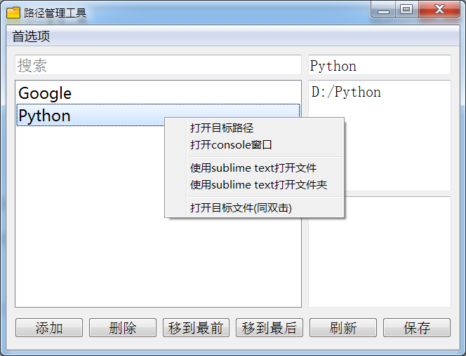

# PathManager

## 安装

### 1. 通过源代码直接使用

Python >= 3.7

```
pip install PySide2
```

双击 pathManager.pyw 便可运行。

### 2. 通过安装包安装

通过安装 release 的安装包安装运行。  

## 界面



## 使用方式

打开 PathManager.pyw 或 PathManager.exe. 然后**可将目标拖动至搜索框下面的控件放下，保存。通过双击每一项来启动。目标可一个或多个，拖动至方框内后可拖动每一项自由排序。**

该目标可以是系统里面可以拖动的东西。**双击的话则是通过系统默认的方式运行这个拖动进去的目标。**

举例说明双击点击控件中的项：

- 文件：用系统默认方式打开该文件。
- 文件夹：打开该文件夹。
- 各种.exe程序：启动程序。
- 各种脚本：使用系统默认方式运行这些脚本。
- 链接：额外功能。可手动输入链接的方式。双击以后通过系统默认浏览器打开链接。 

与此同时，控件的每一项的鼠标右键有相关的功能。如上图所示。
- 双击如果是文件夹就打开文件夹，如果是文件或者程序就使用系统默认方式打开；
- 右键功能：打开目标路径
- 右键功能：在该路径上打开 Console 窗口
- 右键功能：与 sublime text 相关的功能需要在首选项里配置好 sublime text 程序位置

